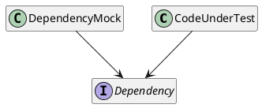
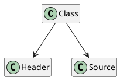
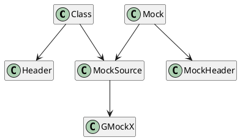
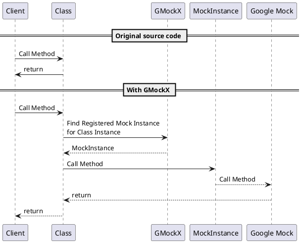

# What is GMockX
Adapter for Google Mock to use with linking time polymorphism.
In simpler words it's a framework where we instrument a linker to link mocks instead of original code.
In even simpler words: you can replace cpp file with mocks in yours test :-)

The whole framework fits in a one hpp file: gmockx.hpp so you can easily #include it in yours test project.

# Why is GMockX
GMocX was created as proof-of-concept workflow to use Google Mock in a code not using interfaces.
Originally GMock is designed to be used with code, where dependencies are injected as C++ interfaces (pure abstract classes). Dependency interface is then implemented by Google Mock _adapter_ to provide (great!) mocking functionality.

It is very simple and straightforward approach.
To ease mocks creation Google provides simple python script which does all work for you!

But...
There is also code around where dependencies are injected as classes or - even worse - are embedded into client code itself. Is such a code we cannot use Google Mock easily. We need some adapter between those dependencies and Google Mocks.
And this is why GMockX was created.

# How does it work
To have it worked the dependency we are trying to mock has to be written using default C++ construction: a hpp files with declarations and a cpp file with definitions.

Now we replace the cpp file with file with mock adapter. Also we add an extra hpp file for that mock containing Google Mock itself.

Now when instance of mock is created it is registered for usage for selected class instances.
On first call to adapter it looks for registered mocks instances, select first free and create mapping between class instance and mock instance.
Then call is forwarded to mapped Google Mock instance.

In Example folder there is simple example of usage of GMockX: DependencyClient has dependency on SolidDependency. SolidDependencyMock is created and used in DependencyClientTestSuite.
